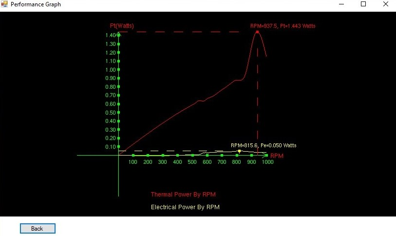

# StirlingEngine
### SE final project- C++ and OpenGL

An application that calculates and displays various graphs for stirling engines.
The calculations steps include importing data from a csv file, using physics formulas and Spline Interpolation to calculate the needed data
for the graph and then displaying the graphs using OpenGL.

* To read more about our project check the 'Stirling Engine.pdf' in the 'Stirling Engine' folder- there you can find a video demo
and our final presentation PowerPoint.
* To run the program and test it check the 'Instructions.docx' file in the 'Stirling Engine/Executible+Files' folder

